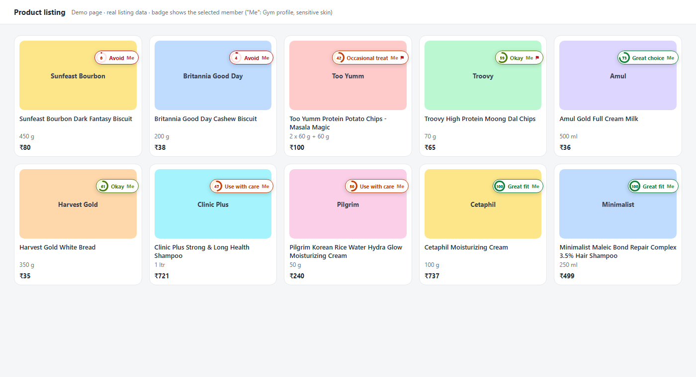
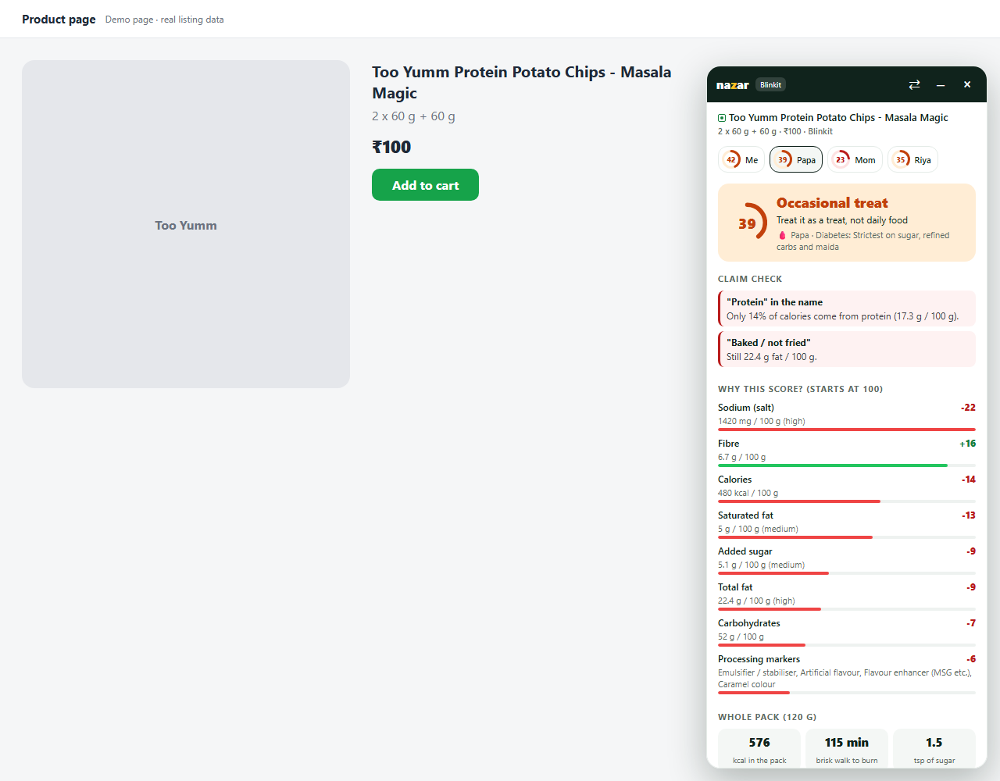
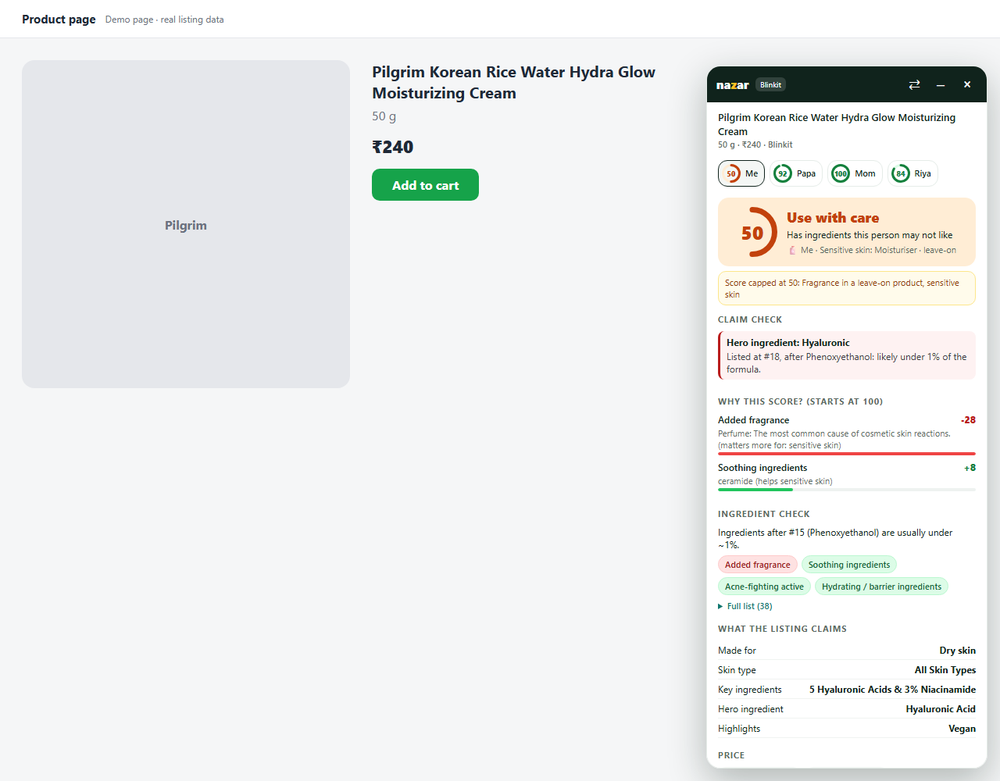
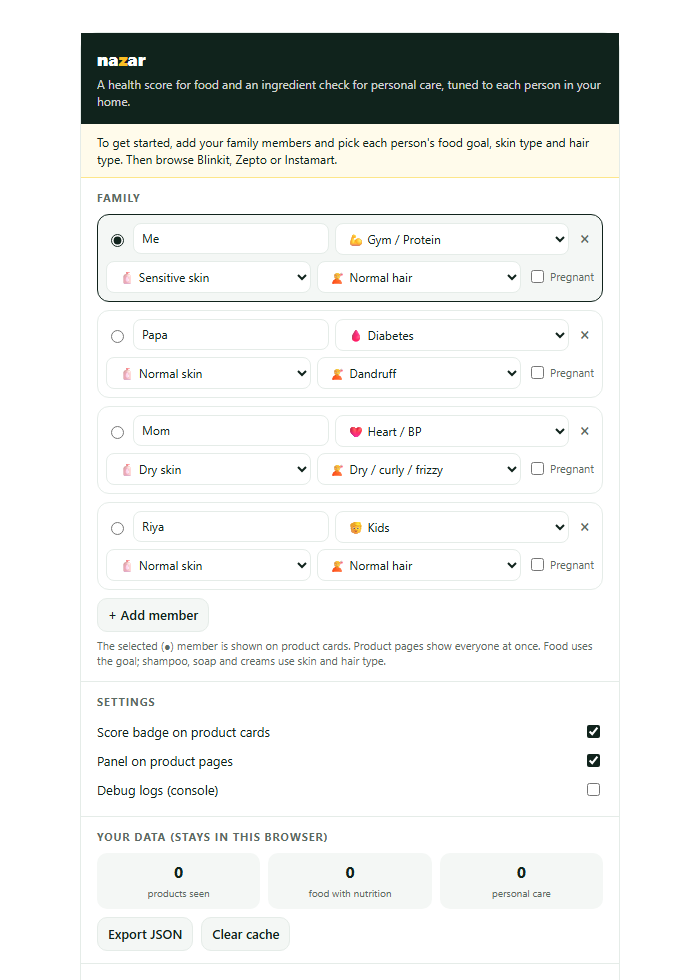

<p align="center">
  
</p>

<h1 align="center">Nazar</h1>

<p align="center">
  <b>Know what's inside, for everyone in your home.</b><br>
  A health score for packaged food and an ingredient check for shampoo, soap and skincare,
  right on Blinkit, Zepto and Instamart.
</p>

<p align="center">
  <a href="release/nazar-v0.2.0.zip"><b>⬇ Download v0.2.0 (zip, 50 KB)</b></a> ·
  <a href="#install-in-2-minutes">Install guide</a> ·
  <a href="#how-the-score-works">How the score works</a>
</p>

---

## What it does

Browse your usual quick-commerce site. Nazar adds a small score badge to every product
card and a detailed panel on product pages.


<sub>Demo page using real listing data. On the real site, badges sit on the product cards the same way.</sub>

### One score per family member

Add your family once: Papa is diabetic, Mom watches her BP, you're at the gym, Riya is
eight. The same packet of chips gets a different score for each of them, side by side.

| Food goals | Personal care traits |
|---|---|
| General, Diabetes, Heart / BP, Weight loss, Gym / Protein, Kids | Skin: normal, oily / acne-prone, dry, sensitive · Hair: normal, dandruff, dry / curly, colour-treated, hair fall · Pregnancy |

### Packaged food: why the score is what it is



- **Why this score?** Every point is shown: "Sodium −22, Fibre +16, Calories −14"
- **Claim check** catches packs that oversell:
  - *"Protein" in the name, but only 14% of calories come from protein*
  - *"Multigrain", but maida is the first ingredient*
  - *"Baked, not fried", yet 22 g fat per 100 g*
- **Whole pack maths:** calories in the pack, minutes of brisk walking, teaspoons of
  sugar, % of daily salt, protein per ₹10
- **Ingredient flags:** palm oil, maida, hydrogenated fat, added sugars, sweeteners,
  synthetic colours, MSG, emulsifiers

### Shampoo, soap, creams: is it right for *this* person?



- Flags **harsh sulfates** (SLS / SLES), **fragrance** and **fragrance allergens**,
  **steroids in fairness creams**, **formaldehyde releasers**, **pore-clogging oils**
  and **retinoids in pregnancy**, weighted for each member's skin and hair
- Rewards ingredients that actually help: anti-dandruff actives, acne actives,
  barrier / hydrating ingredients, soothing ingredients
- **Hero ingredient check:** if the "onion" or "hyaluronic acid" on the front of the pack
  appears after fragrance or preservatives in the list, it's likely **under 1%**
- Catches "sulfate free", "paraben free" and "fragrance free" claims that the
  ingredient list contradicts

### Private by design

- No account and no server: everything runs inside your browser
- Product data is cached locally for 3 days; **nothing is sent anywhere**
- Export what you've seen as JSON from the popup if you want it

---

## Install in 2 minutes

> Nazar is a desktop browser extension (Chrome, Edge or Brave). It does not work in the
> Blinkit / Zepto mobile apps.

**1. Download the zip**

Click **[release/nazar-v0.2.0.zip](release/nazar-v0.2.0.zip)**, then the **Download raw
file** (⬇) button at the top right of the GitHub page.

**2. Unzip it into a folder you'll keep**

Right-click the zip → **Extract All…** → choose a permanent place, e.g.
`Documents\nazar`.
⚠️ Don't delete or move this folder later; the browser loads the extension from it.

**3. Open the extensions page**

| Browser | Type in the address bar |
|---|---|
| Chrome | `chrome://extensions` |
| Edge | `edge://extensions` |
| Brave | `brave://extensions` |

**4. Turn on Developer mode**

Toggle **Developer mode** (top right in Chrome; left sidebar in Edge).

**5. Load the extension**

Click **Load unpacked** and select the folder from step 2 (the one that contains
`manifest.json`).

**6. Pin it**

Click the puzzle-piece icon in the toolbar → pin **Nazar**.

### First-time setup

A setup page opens automatically after install (or click the Nazar icon):



1. Rename **Me** and pick your food goal, skin type and hair type
2. **+ Add member** for everyone else in your home (up to 6)
3. Select (●) the member whose score you want on product cards

### Using it

1. Open **blinkit.com**, **zepto.com** or **swiggy.com/instamart** and log in / set your
   location as usual
2. Search or open any category: badges appear on the cards as you scroll
3. **Click a badge** for the full breakdown without leaving the page
4. Open a product page: the **Nazar panel** shows every family member's score
   - **⇄** moves the panel to the other side
   - **–** shrinks it to a small tab
   - **×** closes it for this product

| Badge | Food | Personal care |
|---|---|---|
| 🟢 70–100 / 75–100 | Great choice | Great fit |
| 🟡 50–69 / 55–74 | Okay | Good fit |
| 🟠 30–49 / 35–54 | Occasional treat | Use with care |
| 🔴 below 30 / 35 | Avoid | Not a fit |
| ⚑ | A claim on the pack doesn't match the label | |

Products with nothing to judge (no nutrition label, or no ingredient list) get no badge.

### Updating to a new version

Download the new zip, extract it **over the same folder** (replace files), then press the
**↻ reload** icon on the Nazar card in `chrome://extensions` and refresh your shopping tab.

### Uninstalling

`chrome://extensions` → Nazar → **Remove**. Then delete the folder.

---

## Troubleshooting

| Problem | Fix |
|---|---|
| No badges appear | Refresh the shopping tab after installing. Check the popup: **Score badge on product cards** must be on. |
| Badge shows on some products only | Products without a nutrition table or ingredient list are skipped on purpose. |
| "Developer mode extensions" warning in Chrome | Expected for extensions installed from a zip. Click **Keep**. Store installs won't show it. |
| The panel covers a button | Click **⇄** to move it to the other side, or **–** to minimise it. Nazar remembers the side per site. |
| Scores look stale | Popup → **Clear cache**, then refresh. |
| Something else | Popup → turn on **Debug logs**, open the browser console (F12) and look for `[Nazar]` lines. |

---

## How the score works

**Food (0–100):** starts at 100. Points are taken off for sugar (added sugar when listed),
saturated fat, total fat, sodium, calories, trans fat and ultra-processing markers, using
UK FSA front-of-pack cut-offs per 100 g / 100 ml. Protein and fibre earn points back.
Each food goal only *adds* strictness on top of General, so no profile can make junk food
look better.

**Personal care (0–100):** a suitability check for one person, not a safety rating.
Ingredients are weighed against that member's skin, hair and pregnancy settings, with caps
for serious mismatches (e.g. steroids, fragrance on sensitive skin, retinoids in
pregnancy).

Full rules: [nazar/README.md](nazar/README.md) and [nazar/src/core/](nazar/src/core/).

## Where it works

| Site | Food | Personal care | Status |
|---|---|---|---|
| Blinkit | ✅ | ✅ | Tested on real listings |
| Zepto | ✅ | ✅ (beta) | Product pages tested; listing badges depend on the site allowing the fetch |
| Swiggy Instamart | 🧪 | 🧪 | Experimental |

## For developers

Code, architecture and tests are in **[nazar/](nazar/)**: see [nazar/README.md](nazar/README.md).

```bash
node nazar/tests/run.js                 # engine tests on real listing fixtures
node nazar/tools/make-screenshots.js    # regenerate the screenshots above
```

---

<sub>Scores are based on the data in each listing, which can differ from the actual pack.
Nazar is not medical advice. It is unofficial and not affiliated with, endorsed by or
sponsored by Blinkit, Zepto, Swiggy or any brand.</sub>
